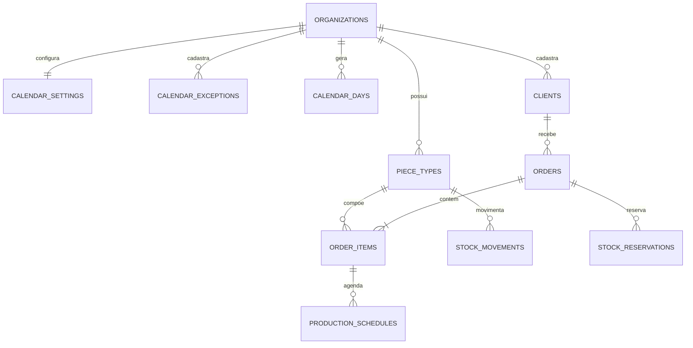

# Diagrama ER — PRELUX

```mermaid
erDiagram
  ORGANIZATIONS ||--|| CALENDAR_SETTINGS : configura
  ORGANIZATIONS ||--o{ CALENDAR_EXCEPTIONS : cadastra
  ORGANIZATIONS ||--o{ CALENDAR_DAYS : gera
  ORGANIZATIONS ||--o{ PIECE_TYPES : possui
  PIECE_TYPES ||--o{ ORDER_ITEMS : compoe
  ORGANIZATIONS ||--o{ CLIENTS : cadastra
  CLIENTS ||--o{ ORDERS : recebe
  ORDERS ||--|{ ORDER_ITEMS : contem
  ORDER_ITEMS ||--o{ PRODUCTION_SCHEDULES : agenda
  PIECE_TYPES ||--o{ STOCK_MOVEMENTS : movimenta
  ORDERS ||--o{ STOCK_RESERVATIONS : reserva
```

As tabelas `v_piece_inventory`, `v_capacity_daily` e `v_order_progress` são visões de leitura para estoque, ocupação e acompanhamento dos pedidos.
